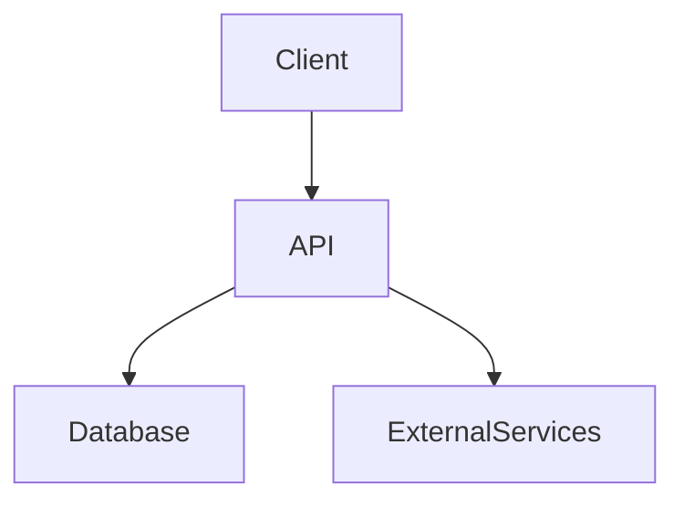

<div align="center">
  <h1 align="center">React Vite Starter</h1>
  <p align="center">
    <strong>Minimal React + Vite + TypeScript + Tailwind + shadcn/ui starter template deployed on Vercel</strong>
  </p>
  <p align="center">
    <!-- Badges -->
    
    
    
    
  </p>
</div>

---

## 📖 Project Overview
Minimal React + Vite + TypeScript + Tailwind + shadcn/ui starter template deployed on Vercel

This repository contains the source code and configuration for `React Vite Starter`. 

---

## 🏗️ Architecture & Folder Structure



<details>
<summary><b>View Folder Structure</b></summary>

```text
react-vite-starter/
├── src/                  # Source code
│   ├── components/       # UI Components
│   ├── api/              # API endpoints/routes
│   └── utils/            # Helper functions
├── tests/                # Unit and integration tests
├── public/               # Static assets
├── .env.example          # Environment variables template
├── package.json          # Project dependencies (or requirements.txt/Cargo.toml)
└── README.md             # Project documentation
```
</details>

---

## 💻 Tech Stack
- **Primary Language:** TypeScript
- **Tags/Technologies:** `react`, `shadcn-ui`, `starter-template`, `tailwindcss`, `typescript`, `vite`


---

## 🚀 Getting Started

### Prerequisites
- Node.js / Python / Docker (depending on stack)
- 

### Installation

1. **Clone the repository:**
   ```bash
   git clone https://github.com/akularya6-del/react-vite-starter.git
   cd react-vite-starter
   ```

2. **Install dependencies:**
   ```bash
   # [PLACEHOLDER: Update with correct install command e.g., npm install or pip install]
   npm install
   ```

3. **Environment Setup:**
   ```bash
   cp .env.example .env
   # [PLACEHOLDER: Fill in the required environment variables in the .env file]
   ```

4. **Run locally:**
   ```bash
   # [PLACEHOLDER: Update with correct run command e.g., npm run dev]
   npm run dev
   ```

---

## 🔧 Configuration & Environment Variables

| Variable Name | Description | Required |
|---------------|-------------|:--------:|
| `API_KEY` | Key for accessing external services | ✅ |
| `PORT` | Port for the server to run on (default 3000) | ❌ |

---

## 🧪 Testing
```bash
# [PLACEHOLDER: Add testing command]
npm run test
```

## 📈 Performance & Security Notes
- **Performance**: 
- **Security**: 

---

## 🤝 Contributing
Contributions, issues, and feature requests are welcome! 
Feel free to check the [issues page](https://github.com/akularya6-del/react-vite-starter/issues).

1. Fork the Project
2. Create your Feature Branch (`git checkout -b feature/AmazingFeature`)
3. Commit your Changes (`git commit -m 'Add some AmazingFeature'`)
4. Push to the Branch (`git push origin feature/AmazingFeature`)
5. Open a Pull Request

---

## 📜 License
Distributed under the MIT License. See `LICENSE` for more information.

---

